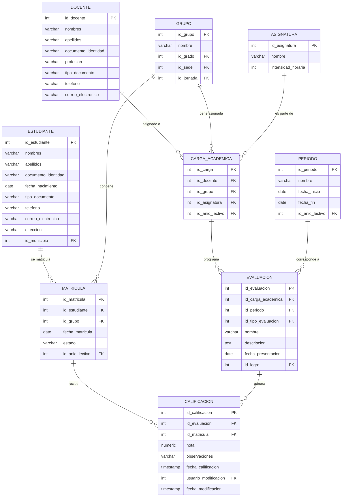

# Sistema de Información Académica EdalmavaSoft
Repositorio del Sistema de Información Académico de **Instituciones Educativas Públicas de Colombia**

El sistema ha sido diseñado para gestionar de manera integral los grupos por grado en distintas sedes de una institución educativa, así como la administración de asignaturas, docentes, cargas académicas, estudiantes y evaluaciones. Su objetivo principal es la generación de instrumentos de evaluación en diversos formatos, los cuales pueden ser respondidos en línea por los estudiantes. Las calificaciones obtenidas se almacenan de forma estructurada, lo que permite la generación de reportes detallados que pueden ser integrados posteriormente con otros sistemas de información institucional. A mediano plazo, se proyecta la evolución de esta plataforma hacia un Sistema de Información Académico (SIA) completo.

En la fase actual del desarrollo, se han generado los scripts correspondientes al esquema de base de datos en PostgreSQL, así como la especificación técnica de la API conforme al estándar OpenAPI.

## Tabla de Contenido

1. [Arquitectura general del sistema](https://github.com/edalmava/sia/blob/main/arquitectura_general.md "Arquitectura general del sistema")

